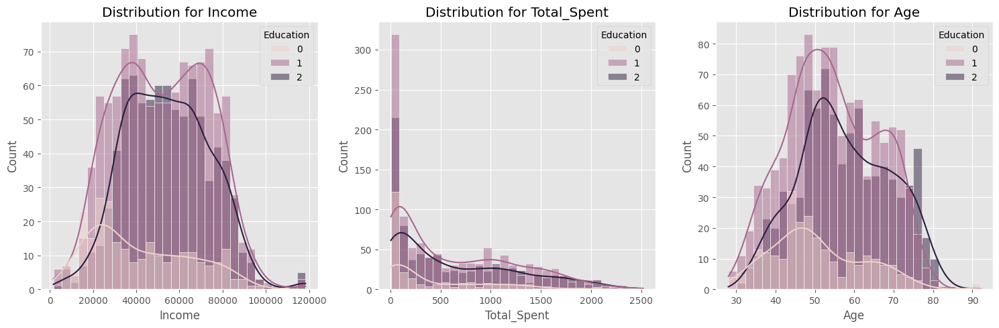
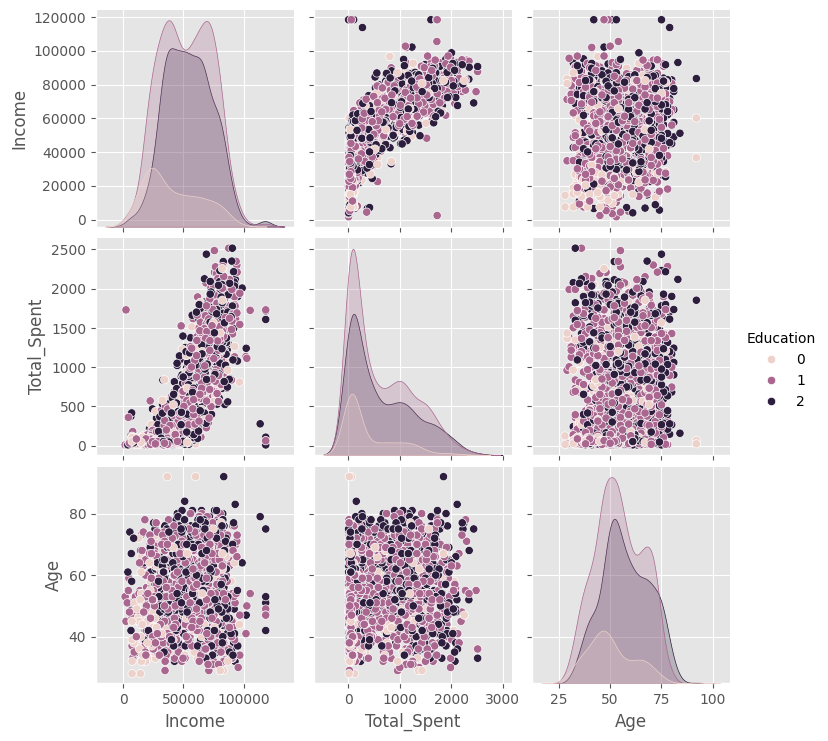
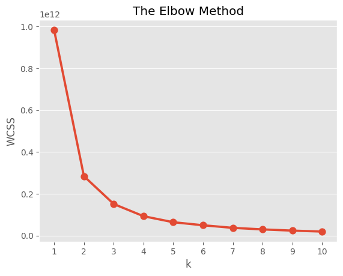

<h1 align="center">Customer Personality Analysis</h1> 

## Background ❓
Customer personality analysis is an essential aspect of modern marketing and business strategy. Understanding the personality traits and behaviors of customers can help businesses tailor their marketing efforts, improve customer satisfaction, and increase sales. By leveraging data-driven approaches, companies can segment their customer base into distinct groups with similar characteristics. This segmentation allows for more personalized and effective marketing strategies, ultimately leading to better customer engagement and loyalty.

## Problem Statement 🚨
Despite the availability of vast amounts of customer data, many businesses struggle to effectively analyze and utilize this information to understand their customers' personalities. Traditional methods of customer segmentation often fall short in capturing the nuanced behaviors and preferences of customers. This lack of detailed insight hinders the ability of businesses to deliver personalized experiences, resulting in missed opportunities for customer retention and revenue growth.

## Objective 🎯
The primary objective of this project is to perform a comprehensive clustering analysis to segment customers based on their personality traits and behaviors. By leveraging clustering techniques, we aim to identify distinct customer personas that can be used to tailor marketing strategies and enhance customer engagement.

## Solution 💡
This is an unsupervised learning clustering problem, where the goal is to segment the customer base into distinct groups. We will employ various machine learning clustering techniques, including K-Means Clustering, DBSCAN, and K-Medoids Clustering, to create these segments. We will evaluate the performance of these clustering models using metrics such as the Silhouette Score. The process will begin with Exploratory Data Analysis (EDA) to gain a deeper understanding of our dataset, followed by the application of the clustering algorithms. After comparing the clustering results based on the evaluation metrics, we will select the best-performing model for deployment. This approach will enable us to accurately identify and group customers personality, facilitating more targeted marketing strategies and personalized services to optimize sales and enhance customer satisfaction.

## 1. Exploratory Data Analysis 💾

I have obtained the data set and now it is time to perform an Exploratory data Analysis (EDA) to gain insight about the dataset and prepare the data for modeling purposes.

**1.1 Dataset**
The dataset is the historical sales data that contains sales from 2010-12-01 to 2011-12-09 which is a total of 699 days. It has 29 features and 2,240 observations. The following are a short information of our feature: 

**People:**

`ID` : Customer's unique identifier

`Year_Birth` : Customer's birth year

`Education` : Customer's education level

`Marital_Status` : Customer's marital status

`Income` : Customer's yearly household income

`Kidhome` : Number of children in customer's household

`Teenhome` : Number of teenagers in customer's household

`Dt_Customer` : Date of customer's enrollment with the company

`Recency` : Number of days since customer's last purchase

`Complain` : 1 if the customer complained in the last 2 years, 0 otherwise

**Products:**

`MntWines` : Amount spent on wine in last 2 years

`MntFruits` : Amount spent on fruits in last 2 years

`MntMeatProducts` : Amount spent on meat in last 2 years

`MntFishProducts` : Amount spent on fish in last 2 years

`MntSweetProducts` : Amount spent on sweets in last 2 years

`MntGoldProds` : Amount spent on gold in last 2 years

**Promotion:**

`NumDealsPurchases` : Number of purchases made with a discount

`AcceptedCmp1` : 1 if customer accepted the offer in the 1st campaign, 0 otherwise

`AcceptedCmp2` : 1 if customer accepted the offer in the 2nd campaign, 0 otherwise

`AcceptedCmp3` : 1 if customer accepted the offer in the 3rd campaign, 0 otherwise

`AcceptedCmp4` : 1 if customer accepted the offer in the 4th campaign, 0 otherwise

`AcceptedCmp5` : 1 if customer accepted the offer in the 5th campaign, 0 otherwise

`Response` : 1 if customer accepted the offer in the last campaign, 0 otherwise

**Place of Purchase :**

`NumWebPurchases` : Number of purchases made through the company’s website

`NumCatalogPurchases` : Number of purchases made using a catalog

`NumStorePurchases` : Number of purchases made directly in stores

`NumWebVisitsMonth` : Number of visits to company’s website in the last month

**1.2 Data Preprocessing And Feature Engineering**

**1.2.1 Data Preprocessing**

The data preprocessing includes the following steps:

- Cleaning and handling missing values.
- Capping Outlier using IQR technique
- Dropping unnecessary features

**1.2.2 Feature Engineering:**

During the feature engineering process I use the original features to create some new relevant features that capture customer behavior and engagement. These features were obtained by using existing customer data and accurately reflect the values that these features should contain for the given customer. These features add a whole new and better dimensionality by which a customer cluster can be identified. A total of 7 features were derived and the following are these features: 

`Age` : The Age of the customer derived from Year_Birth

`Total_Spent` : The total spent by the customer which is a sum of all features in the “products” category.

`Children` : The total number of children the customer has.

`living_with` : The value is 0 if the customer lives alone and is 1 if the customer lives with others

`family_size` : The size of the customer's family.

`Is_Parent` : The value is 0 if the customer is not a parent and is 1 if the customer is a parent 

`Married` : The value is 0 if the customer is not married and is 1 if the customer is a married 

## 2. Data distribution and Descriptive statistic Visualization

The following diagrams show the distribution of the four major features "Age", "Income", "Total_Spent", and "Education" through pair plots and histograms. These visualizations are crucial for understanding our customer base. 

**2.1 Histogram**

The diagram below shows the distribution of our three features with education as the hue.

<strong>Figure 1. Feature Distribution for Income,Spent,Age</strong>

**2.2 Pair plot**

The diagram below shows the pair plot of our three features with education as the hue. There are KDE plots and scatter plots for each feature against the other. This helps us observe the relationship between these features.

  

<strong>Figure 2. Pair Plot</strong>

## 3 Machine Learning Approach

I will be implementing and comparing  K-means, DBSCAN, and K medoid clustering to cluster our dataset. I have determined the optimal number of clusters using methods like the Elbow method, Silhouette score

**Figure 3. The Elbow Method**

## 4. Evaluation

The following are the Silhouette score, Davies-Bouldin Index, and Calinski-Harabasz Index for our models:

**4.1 Metrics Overview:**

`K means Clustering`:

<strong>Silhouette score: 0.5442126866165884</strong>

<strong>Davies-Bouldin Index: 0.5482239239539933</strong>

<strong>Calinski-Harabasz Index: 6099.403519951906</strong>

`DBSCAN`:

<strong>Silhouette score: -0.7580272402830124</strong>

<strong>Davies-Bouldin Index: 1.0304901525291839</strong>

<strong>Calinski-Harabasz Index: 4.249458998733949</strong>

`K-Medoids` : 

<strong>Silhouette score: 0.5399221408024186</strong>

<strong>Davies-Bouldin Index: 0.547363762370909</strong>

<strong>Calinski-Harabasz Index:6025.901674737833</strong>

**4.2 Conclusion:**

Given the metrics, K-Means Clustering is the best model among the three. It has the highest Silhouette Score and Calinski-Harabasz Index, and although its Davies-Bouldin Index is marginally higher than K-Medoids, the differences are minimal and compensated by the other two metrics indicating superior performance.

## 5. Cluster Quality and Interpretation through Visualization

I will now access cluster quality and interpretability of the cluster through various visualizations with regards to the machine learning cluster. I have used the clustering results from K-means clustering as this model provided the best performance.

**5.1 Cluster Visualization**

The following are the visualization of our data set to determine the nature of each of our clusters. 

Figure 4. Cluster Countplot

Figure 4. Distribution of Cluster by feature

Figure 5. Countplot of Promotion Accepted by cluster

Figure 6. Boxenplot of features by cluster

Figure 7. Boxplot of features by cluster

Figure 8. Scatter Plot by cluster

Figure 7. Countplot for feature by cluster

**5.2 Cluster Observation**

The following observations can be made about each of the cluster:

**Cluster 0**

- There are 730 unique customers in this cluster
- This cluster is in the middle range when in come to customer income and amount spent
- On average the number of deals purchase is higher in this cluster
  
 `Age`: The average age in this cluster is about 57 years old 
 
 `Income`: The average yearly household income of customers in this cluster is about $50,000
 
 `Spent`: Total spending for the last two years of customers in this cluster is on average $490 
 
 `Complain`: This cluster has the lowest number of complain i.e. 3
 
 `Response`: This cluster has the lowest response to campaigns compared to other clusters
 
 `Is_Parent`: This cluster has a really small group of non parent customers i.e. 73. 
 
 `Promotion Accepted`: This cluster has a fair amount of accepted promotions with 127 promotion accepted

**Cluster 1**

- There are 751 unique customers in this cluster 
- This cluster is the top tier customers with high income and amount spent
- On average the number of deals purchase in this cluster is lowest 
 
 `Age`: The average age in this cluster is about 55 years old 
 
 `Income`: The average yearly household income of customers in this cluster is about $750,000
 
 `Spent`: Total spending for the last two years of customers in this cluster is on average $1250 
 
 `Complain`: This cluster also has fairly few number of complain i.e. 5
 
 `Response`: This cluster responds very well to campaign as 174 converted to buying at the last campaign
 
 `Is_Parent`: This cluster has the largest group of non parent customers i.e. 445. 
 
 `Promotion Accepted`: This cluster has the highest amount of accepted promotions with 463 promotion accepted
 
**Cluster 2**

- There are 762 unique customers in this cluster
- This cluster is in the lowest range when in come to customer with the lowest income and amount spent
- On average the number of deals purchased is higher in this cluster so incentivising this cluster with more deals can be a good strategy. 
 
 `Age`: The average age in this cluster is lowest i.e. 50 years old 
 
 `Income`: The average yearly household income of customers in this cluster is about $30,000
 
 `Spent`: Total spending for the last two years of customers in this cluster on average is only slightly above $0
 
 `Complain`: This cluster has the largest number of complain i.e. 13
 
 `Response`: This cluster has a fair response to campaigns compared to other clusters
 
 `Is_Parent`: This cluster has the largest group of parent customers i.e. 647. 
 
 `Promotion Accepted`: This cluster has the highest amount of rejected promotions with 692 promotion rejected

